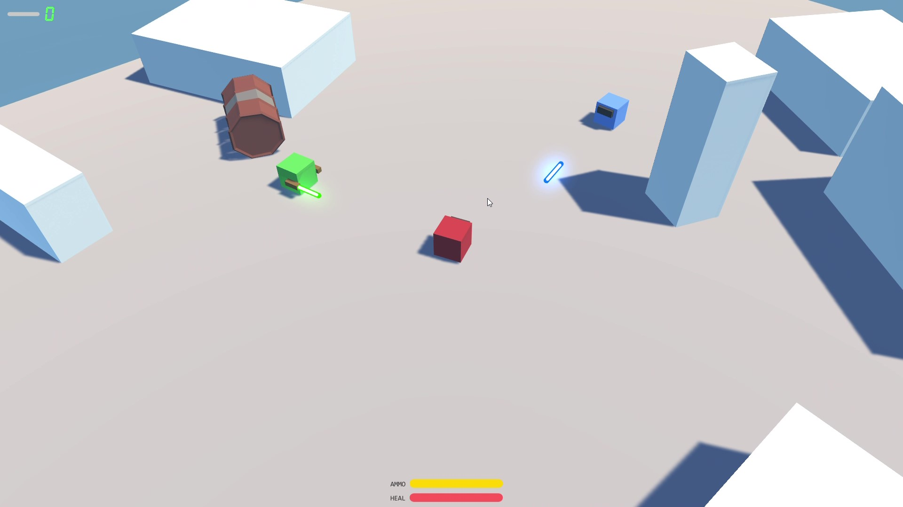
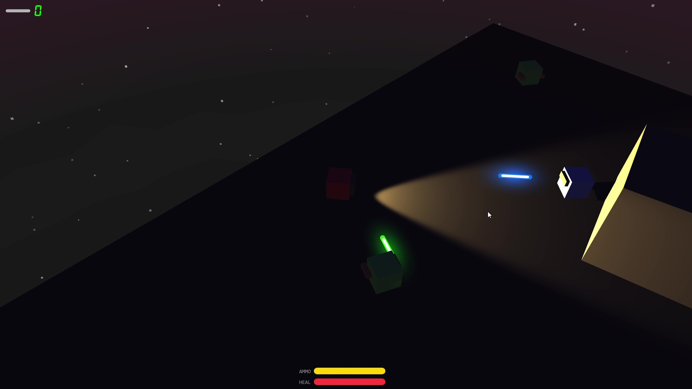
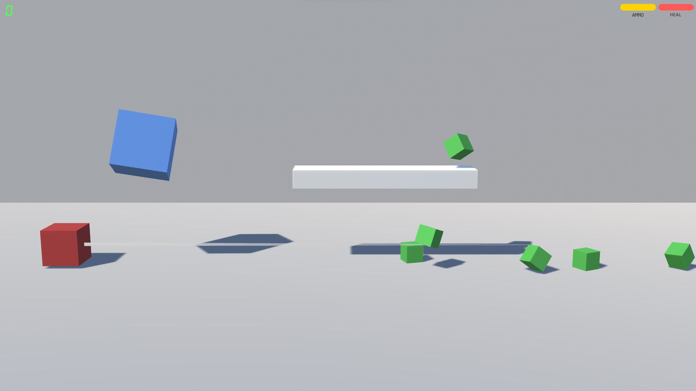
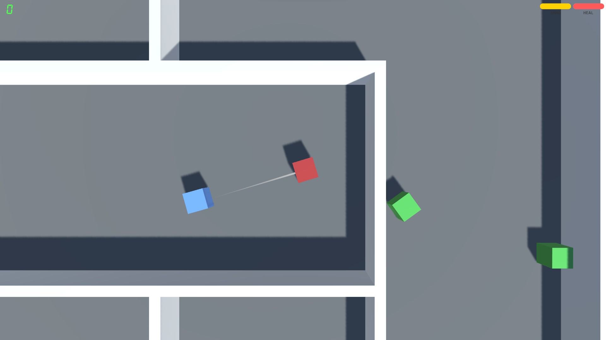

# Pi Shooting

This is a repository of a shooting game run on a Raspberry Pi based on Unity 3D.

##### Develop environment

- Unity 3D 2020.3 LTS with Android Build Support
- .NET SDK 6.0

##### Test environment

- Raspberry Pi 3B+
- LineageOS 17.1 unofficial

## How to start playing

1. Build the project and prepare the game package.

   There are three game scenes in our folder `project/`, open one of them through Unity 3D. Switch to Android platform in settings, then build. Save the generated `.apk` file after the building is finished.

2. Flash an Android operating system for your Raspberry Pi.

   Download the system image in [XDA Forums](https://forum.xda-developers.com/t/dev-rom-unofficial-lineageos-17-1-android-10-for-raspberry-pi-3-b-and-b.4139051/), then use the Raspberry Pi Imager to flash it into your SD card.

3. Boot system and download your game package.

   You can transport your game package using a portable disk through USB port or using network component on board.

4. Install the game and enjoy it.

## Screenshot

